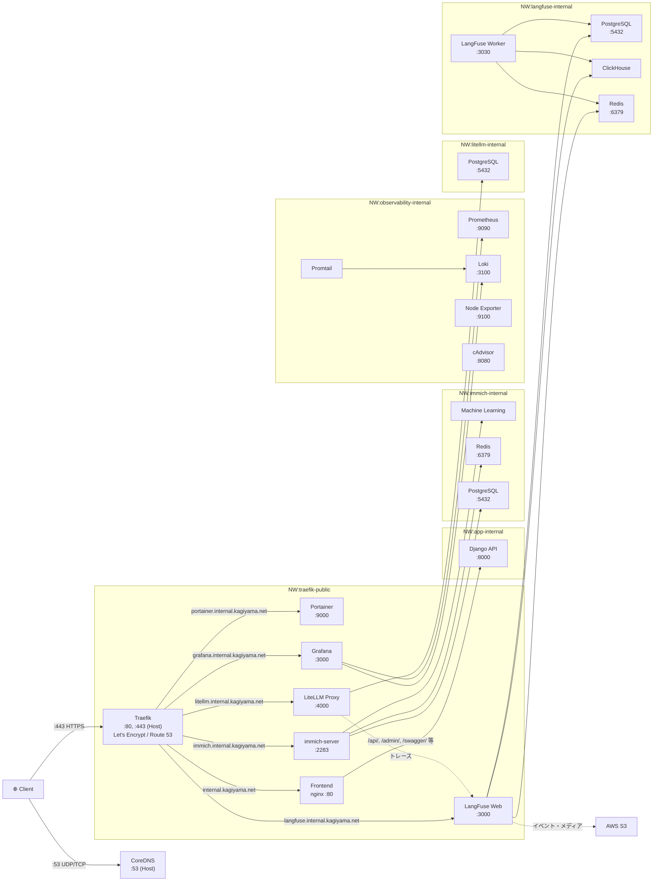

# 鍵山製パン 自宅サーバシステム

[](https://www.ansible.com/)
[](https://www.docker.com/)
[](https://docs.docker.com/compose/)
[](https://github.com/features/actions)
[](https://opentofu.org/)
[](https://tailscale.com/)
[](https://www.gnu.org/software/make/)

## 目次

- [概要](#概要)
- [環境](#環境)
- [サービス構成](#サービス構成)
    - [アーキテクチャ図](#アーキテクチャ図)
- [初期セットアップ](#初期セットアップ)
- [デプロイ](#デプロイ)
    - [開発機からのデプロイ](#開発機からのデプロイ)
    - [サーバ上で直接実行](#サーバ上で直接実行)
- [バックアップ](#バックアップ)
    - [概要](#バックアップ概要)
    - [バックアップ対象](#バックアップ対象)
    - [手動実行](#手動実行)
    - [状態確認](#状態確認)
    - [リストア](#リストア)
- [インフラ管理（OpenTofu）](#インフラ管理opentofu)
- [CI/CD](#cicd)
    - [CI: Ansible Lint](#ci-ansible-lint)
    - [CD: 自動デプロイ](#cd-自動デプロイ)
- [Ansible の詳細](#ansible-の詳細)

## 概要

UTM上で構築したUbuntu Server環境を管理するためのAnsibleプレイブック群です。
Ansibleを使用して、サーバのセットアップや構成管理を自動化します。

## 環境

- ホストマシン: Mac mini (2018)
- ゲストマシン: Ubuntu Server 22.04.4 (UTM上)

## サービス構成

| サービス                                                                                                       | 説明                                  | FQDN                              |
| -------------------------------------------------------------------------------------------------------------- | ------------------------------------- | --------------------------------- |
| [CoreDNS](https://coredns.io/)                                                                                 | 内部DNSサーバ                         | —                                 |
| [Traefik](https://traefik.io/)                                                                                 | リバースプロキシ（Let's Encrypt統合） | —                                 |
| [Portainer](https://www.portainer.io/)                                                                         | Docker管理UI                          | `portainer.internal.kagiyama.net` |
| [Immich](https://immich.app/)                                                                                  | 写真・動画管理                        | `immich.internal.kagiyama.net`    |
| [Grafana](https://grafana.com/) / [Prometheus](https://prometheus.io/) / [Loki](https://grafana.com/oss/loki/) | Observability スタック                | `grafana.internal.kagiyama.net`   |
| [kawashiro-server](https://github.com/kagiyama-baking/kawashiro-server)                                        | Django REST API + React SPA           | `internal.kagiyama.net`           |
| [LiteLLM](https://docs.litellm.ai/)                                                                           | LLMプロバイダー抽象化プロキシ         | `litellm.internal.kagiyama.net`   |
| [LangFuse](https://langfuse.com/)                                                                              | LLMオブザーバビリティ（トレース）     | `langfuse.internal.kagiyama.net`  |
| [autorestic](https://autorestic.vercel.app/) / [restic](https://restic.net/)                                   | 自動バックアップ（→ AWS S3）          | —                                 |

### アーキテクチャ図



> **Note:** ポート番号はコンテナ内部ポート。Portainer(:9443)、Immich(:2283)、Grafana(:3000) は
> ホストの `127.0.0.1` にもバインドされるが、通常は Traefik 経由でアクセスする。
> Django API はホストに公開されず、Frontend の nginx 経由でのみアクセス可能。
> LiteLLM は LangFuse にトレースを送信し、LangFuse は AWS S3 にイベント・メディアデータを保存する。

## 初期セットアップ

1.  UTMをインストール

    https://mac.getutm.app/ からUTMをダウンロードしてインストールする。

2.  ISOイメージのダウンロード

    ここでは、Ubuntu Server 22.04.4を使用。
    https://ubuntu.com/download/server からダウンロードできる。

3.  UTMでUbuntu Server 22.04.4をインストール

    ネットワーク設定は「ブリッジモード」を選択すること。

4.  パッケージのアップデート

    ```bash
    sudo apt update
    sudo apt upgrade -y
    ```

5.  Tailscaleのインストール

    ```bash
    curl -fsSL https://tailscale.com/install.sh | sh
    sudo tailscale up
    ```

    表示されるURLをブラウザで開き、認証を完了する。

    ```bash
    # IPv4/6 forwarding を有効化

    sudo sysctl -w net.ipv4.ip_forward=1
    echo 'net.ipv4.ip_forward=1' | sudo tee -a /etc/sysctl.d/99-tailscale.conf

    sudo sysctl -w net.ipv6.conf.all.forwarding=1
    echo 'net.ipv6.conf.all.forwarding=1' | sudo tee -a /etc/sysctl.d/99-tailscale.conf
    ```

    ```bash
    # UDP GRO forwarding を設定（パフォーマンス改善）
    sudo ethtool -K enp0s1 rx-udp-gro-forwarding on rx-gro-list off

    sudo tee /etc/networkd-dispatcher/routable.d/50-tailscale > /dev/null <<'EOF'
    #!/bin/sh
    ethtool -K enp0s1 rx-udp-gro-forwarding on rx-gro-list off
    EOF
    sudo chmod +x /etc/networkd-dispatcher/routable.d/50-tailscale

    ```

    ```bash
    # Tailscaleをサブネットルーターとして設定
    sudo tailscale up \
    --advertise-routes=172.17.2.0/24 \
    --accept-routes \
    --ssh
    ```

    管理画面で internal の Subnet を Approve する。

6.  Gitのインストール

    ```bash
    sudo apt install -y git
    ```

7.  Ansibleのインストール

    ```bash
    sudo apt install -y pipx             # pipxをインストール
    pipx install ansible --include-deps  # Ansibleとその依存関係をインストール
    pipx ensurepath                      # パスを通す
    source ~/.bashrc                     # シェルを再読み込みしてpipxのパスを反映
    ```

8.  Makeをインストール

    ```bash
    sudo apt install -y make # Makefileを使用するために必要
    ```

9.  SSHキーの生成と登録

    SSHキーを生成する。

    ```bash
    ssh-keygen -t ed25519 -C "your_email@example.com"
    ```

    公開鍵を表示し、GitHubに登録する。

    ```bash
    cat ~/.ssh/id_ed25519.pub
    ```

    表示された公開鍵をコピーし、GitHub の **Settings > SSH and GPG keys > New SSH key** から登録する。

10. このリポジトリをcloneする

    ```bash
    git clone git@github.com:kagiyama-baking/internal.kagiyama.net.git # SSHでクローン
    cd internal.kagiyama.net                                           # クローンしたリポジトリに移動
    ```

11. テスト用プレイブックを実行して動作確認

    ```bash
    cd ansible # ansibleディレクトリに移動
    make test  # テスト用プレイブックを実行
    ```

## デプロイ

### 開発機からのデプロイ

サーバにログインせずに、開発機から直接デプロイできます。
プロジェクトルートの Makefile が SSH で `git pull` → Ansible 実行をワンコマンドで行います。

#### 前提条件

- 開発機からサーバへ SSH 接続できること（`~/.ssh/config` を設定推奨）
- サーバ上にこのリポジトリが clone 済みであること

#### SSH 接続先の設定

Makefile 内のデフォルト値を環境に合わせて変更するか、実行時に指定してください。

```makefile
SSH_HOST ?= internal.kagiyama.net      # ~/.ssh/config のホスト名
REMOTE_DIR ?= ~/internal.kagiyama.net  # サーバ上のリポジトリパス
```

#### コマンド一覧

| コマンド                    | 説明                                                 |
| --------------------------- | ---------------------------------------------------- |
| `make deploy-test`          | テスト用プレイブックのみ実行                         |
| `make deploy-setup`         | セットアップを実行（sudo パスワード入力あり）        |
| `make deploy-coredns`       | CoreDNS をデプロイ（Vault パスワード入力あり）       |
| `make deploy-portainer`     | Portainer をデプロイ                                 |
| `make deploy-traefik`       | Traefik をデプロイ（Vault パスワード入力あり）       |
| `make deploy-immich`        | Immich をデプロイ（Vault パスワード入力あり）        |
| `make deploy-observability` | Observability をデプロイ（Vault パスワード入力あり） |
| `make deploy-app`           | アプリケーション をデプロイ（Vault パスワード入力あり） |
| `make deploy-litellm`       | LiteLLM をデプロイ（Vault パスワード入力あり）       |
| `make deploy-langfuse`      | LangFuse をデプロイ（Vault パスワード入力あり）      |
| `make deploy-backup`        | バックアップ設定 をデプロイ（Vault パスワード入力あり） |
| `make deploy-backup-status` | バックアップ状態を確認                               |
| `make deploy-backup-run`    | バックアップを手動実行                               |
| `make deploy-check`         | ドライラン（変更を適用せず確認のみ）                 |

ホスト名を一時的に変更して実行することもできます。

```bash
make deploy-test SSH_HOST=my-server
```

### サーバ上で直接実行

サーバにSSHログインした状態で、`ansible/` ディレクトリ内から直接実行できます。

| コマンド             | 説明                                                 |
| -------------------- | ---------------------------------------------------- |
| `make test`          | テスト用プレイブックを実行                           |
| `make setup`         | セットアップを実行（sudo パスワード入力あり）        |
| `make coredns`       | CoreDNS をデプロイ（Vault パスワード入力あり）       |
| `make portainer`     | Portainer をデプロイ                                 |
| `make traefik`       | Traefik をデプロイ（Vault パスワード入力あり）       |
| `make immich`        | Immich をデプロイ（Vault パスワード入力あり）        |
| `make observability` | Observability をデプロイ（Vault パスワード入力あり） |
| `make app`           | アプリケーション をデプロイ（Vault パスワード入力あり） |
| `make litellm`       | LiteLLM をデプロイ（Vault パスワード入力あり）       |
| `make langfuse`      | LangFuse をデプロイ（Vault パスワード入力あり）      |
| `make backup`        | バックアップ設定 をデプロイ（Vault パスワード入力あり） |
| `make backup-status` | バックアップ状態を確認                               |
| `make backup-run`    | バックアップを手動実行                               |
| `make check`         | ドライラン（変更を適用せず確認のみ）                 |

## バックアップ

### バックアップ概要

[autorestic](https://autorestic.vercel.app/)（[restic](https://restic.net/) のラッパー）を使用して、サーバ上の重要データを AWS S3 に自動バックアップしています。

- **スケジュール**: 毎日午前 3:00（cron）
- **保存先**: AWS S3
- **リテンション**: 日次 7 世代
- **暗号化**: restic による AES-256 暗号化（S3 上のデータは全て暗号化済み）

### バックアップ対象

| Location | 内容 | バックアップ方法 |
|----------|------|------------------|
| `immich-db` | Immich の PostgreSQL 全データベース | `docker exec pg_dumpall` でダンプ後にバックアップ |
| `immich-library` | Immich の写真・動画ファイル（`/opt/immich/library`） | ディレクトリを直接バックアップ |
| `app-db` | kawashiro-server の SQLite データベース | `sqlite3 .backup` でコピー後にバックアップ |

### 手動実行

```bash
# サーバ上で直接実行
make backup-run

# 開発機からリモート実行
make deploy-backup-run

# ログを確認（syslog に出力される）
journalctl -t autorestic-backup
```

### 状態確認

```bash
# サーバ上で直接実行
make backup-status

# 開発機からリモート実行
make deploy-backup-status
```

### リストア

restic は空でないディレクトリへのリストアを拒否するため、location ごとに別ディレクトリに復元します。

```bash
cd /opt/backup

# 1. 一時ディレクトリに復元（location ごとに分ける）
PATH=/opt/backup/bin:$PATH autorestic restore -l app-db -c .autorestic.yml --to /tmp/restore-app
PATH=/opt/backup/bin:$PATH autorestic restore -l immich-db -c .autorestic.yml --to /tmp/restore-immich-db
PATH=/opt/backup/bin:$PATH autorestic restore -l immich-library -c .autorestic.yml --to /tmp/restore-immich-lib

# 2. 復元されたファイルを確認（バックアップ時の絶対パス構造で展開される）
ls /tmp/restore-app/opt/backup/dumps/app/db.sqlite3
ls /tmp/restore-immich-db/opt/backup/dumps/immich/pg_dump.sql
ls /tmp/restore-immich-lib/opt/immich/library/

# 3. 内容を確認してから本番パスにコピー
```

> **Note:** 復元先にはバックアップ時のフルパス構造がそのまま展開されます。必ず一時ディレクトリに復元し、内容を確認してから本番データにコピーしてください。

## インフラ管理（OpenTofu）

LangFuse が使用する AWS リソース（S3 バケット・IAM ユーザー）を [OpenTofu](https://opentofu.org/) で管理しています。

### 管理対象

| リソース | 説明 |
|----------|------|
| S3 バケット × 3 | LangFuse 用（event, media, export） |
| IAM ユーザー | S3 アクセス用（最小権限） |

### ディレクトリ構成

```
tofu/
├── main.tf          # プロバイダー設定（AWS, ap-northeast-1）
├── s3.tf            # S3 バケット定義（暗号化・パブリックアクセスブロック付き）
├── iam.tf           # IAM ユーザー・ポリシー定義
├── variables.tf     # 変数定義（リージョン、プレフィックス等）
├── outputs.tf       # 出力値（アクセスキー、バケット名）
└── Makefile         # OpenTofu 操作コマンド
```

### 使い方

`tofu/` ディレクトリ内で実行します。

| コマンド | 説明 |
|----------|------|
| `make init` | プロバイダーのインストール |
| `make plan` | 実行計画を確認（ドライラン） |
| `make apply` | リソースを作成・更新 |
| `make destroy` | リソースを削除 |
| `make output` | 出力値を表示 |
| `make secret` | シークレットアクセスキーを表示（Ansible vault 格納用） |

> **Note:** `make secret` で取得した認証情報は `ansible/roles/langfuse/vars/vault.yml` に格納すること。

## CI/CD

GitHub Actions で CI/CD パイプラインを構成しています。

### CI: Ansible Lint

PR作成時に `yamllint` と `ansible-lint` を自動実行します。

- **トリガー**: `main` へのPR（`ansible/**` パス変更時）、手動実行
- **ワークフロー**: `.github/workflows/ansible_lint.yml`

### CD: 自動デプロイ

`main` ブランチへのマージ時に、変更されたロールを自動デプロイします。

- **トリガー**: `main` への push（`ansible/**` パス変更時）、手動実行（ロール指定可）
- **ワークフロー**: `.github/workflows/deploy.yml`
- **仕組み**: Tailscale VPN 経由で SSH 接続し、変更されたロールのみ `ansible-playbook` を実行

#### 変更検知ロジック

| 変更パス                                    | デプロイ対象   |
| ------------------------------------------- | -------------- |
| `ansible/roles/<role>/**`                   | 該当ロールのみ |
| `ansible/group_vars/**`、`ansible/site.yml` | 全ロール       |
| 上記以外                                    | スキップ       |

> **Note:** `setup` ロールは `--ask-become-pass`（sudo）が必要なため、CD から除外しています。

## Ansible の詳細

ロール構成、Vault 管理、ディレクトリ構成の詳細は [ansible/README.md](ansible/README.md) を参照してください。
