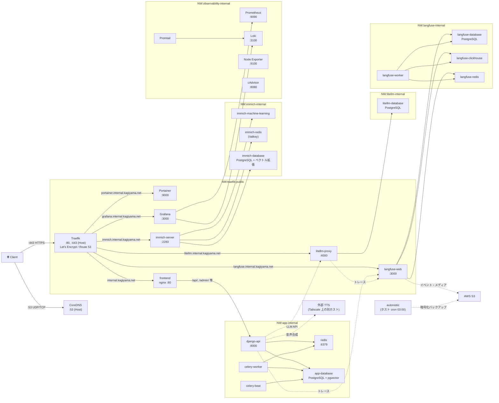

# 鍵山製パン 自宅サーバシステム

[](https://www.ansible.com/)
[](https://www.docker.com/)
[](https://docs.docker.com/compose/)
[](https://github.com/features/actions)
[](https://opentofu.org/)
[](https://tailscale.com/)
[](https://www.gnu.org/software/make/)

## 目次

- [概要](#概要)
- [環境](#環境)
- [サービス構成](#サービス構成)
    - [アーキテクチャ図](#アーキテクチャ図)
- [リポジトリ構成](#リポジトリ構成)
- [ドキュメントマップ](#ドキュメントマップ)
- [デプロイ](#デプロイ)
- [バックアップ](#バックアップ)
- [インフラ管理（OpenTofu）](#インフラ管理opentofu)
- [CI/CD](#cicd)

## 概要

UTM 上の Ubuntu Server で稼働する自宅サーバ一式を、このリポジトリで宣言的に管理します。

- **構成管理**: Ansible（ロール = サービス単位、タグ指定デプロイ）
- **クラウドリソース**: OpenTofu（LangFuse 用 AWS S3 / IAM）
- **CI/CD**: GitHub Actions（Lint・自動デプロイ・ドキュメント整合性チェック）

## 環境

- ホストマシン: Mac mini (2018)
- ゲストマシン: Ubuntu Server 24.04.4 LTS (UTM上)

## サービス構成

| サービス | 説明 | FQDN | ロール |
| --- | --- | --- | --- |
| [CoreDNS](https://coredns.io/) | 内部DNSサーバ | — | [coredns](ansible/roles/coredns/README.md) |
| [Traefik](https://traefik.io/) | リバースプロキシ（Let's Encrypt統合） | — | [traefik](ansible/roles/traefik/README.md) |
| [Portainer](https://www.portainer.io/) | Docker管理UI | `portainer.internal.kagiyama.net` | [portainer](ansible/roles/portainer/README.md) |
| [Immich](https://immich.app/) | 写真・動画管理 | `immich.internal.kagiyama.net` | [immich](ansible/roles/immich/README.md) |
| [Grafana](https://grafana.com/) / [Prometheus](https://prometheus.io/) / [Loki](https://grafana.com/oss/loki/) | 監視・ログ・アラート | `grafana.internal.kagiyama.net` | [observability](ansible/roles/observability/README.md) |
| [kawashiro-server](https://github.com/kagiyama-baking/kawashiro-server) | Django REST API + React SPA | `internal.kagiyama.net` | [app](ansible/roles/app/README.md) |
| [LiteLLM](https://docs.litellm.ai/) | LLMプロバイダー抽象化プロキシ | `litellm.internal.kagiyama.net` | [litellm](ansible/roles/litellm/README.md) |
| [LangFuse](https://langfuse.com/) | LLMオブザーバビリティ（トレース） | `langfuse.internal.kagiyama.net` | [langfuse](ansible/roles/langfuse/README.md) |
| [autorestic](https://autorestic.vercel.app/) / [restic](https://restic.net/) | 自動バックアップ（→ AWS S3） | — | [backup](ansible/roles/backup/README.md) |

### アーキテクチャ図


```mermaid
graph LR
    Browser["🌐 Client"]
    Browser -->|":443 HTTPS"| Traefik

    Browser -->|":53 UDP/TCP"| CoreDNS["CoreDNS<br>:53 (Host)"]

    subgraph traefik-public["NW:traefik-public"]
        Traefik["Traefik<br>:80, :443 (Host) <br>Let's Encrypt / Route 53"]
        Portainer["Portainer<br>:9000"]
        ImmichServer["immich-server<br>:2283"]
        Grafana["Grafana<br>:3000"]
        Frontend["frontend<br>nginx :80"]
        LiteLLMProxy["litellm-proxy<br>:4000"]
        LangFuseWeb["langfuse-web<br>:3000"]
    end

    Traefik -->|"portainer.internal.kagiyama.net"| Portainer
    Traefik -->|"immich.internal.kagiyama.net"| ImmichServer
    Traefik -->|"grafana.internal.kagiyama.net"| Grafana
    Traefik -->|"internal.kagiyama.net"| Frontend
    Traefik -->|"litellm.internal.kagiyama.net"| LiteLLMProxy
    Traefik -->|"langfuse.internal.kagiyama.net"| LangFuseWeb

    subgraph app-internal["NW:app-internal"]
        Frontend
        DjangoAPI["django-api<br>:8000"]
        CeleryWorker["celery-worker"]
        CeleryBeat["celery-beat"]
        AppRedis["redis<br>:6379"]
        AppDB["app-database<br>PostgreSQL + pgvector"]
    end

    Frontend -->|"/api/, /admin/ 等"| DjangoAPI
    DjangoAPI --> AppDB
    DjangoAPI --> AppRedis
    CeleryWorker --> AppRedis
    CeleryWorker --> AppDB
    CeleryBeat --> AppDB

    DjangoAPI -.->|"LLM API"| LiteLLMProxy
    DjangoAPI -.->|"トレース"| LangFuseWeb
    DjangoAPI -.->|"音声合成"| TTS["外部 TTS<br>(Tailscale 上の別ホスト)"]

    subgraph immich-internal["NW:immich-internal"]
        ImmichServer
        MachineLearning["immich-machine-learning"]
        ImmichRedis["immich-redis<br>(Valkey)"]
        ImmichDB["immich-database<br>PostgreSQL + ベクトル拡張"]
    end

    ImmichServer --> ImmichRedis
    ImmichServer --> ImmichDB
    ImmichServer --> MachineLearning

    subgraph observability-internal["NW:observability-internal"]
        Grafana
        Prometheus["Prometheus<br>:9090"]
        Loki["Loki<br>:3100"]
        Promtail["Promtail"]
        NodeExporter["Node Exporter<br>:9100"]
        cAdvisor["cAdvisor<br>:8080"]
    end

    Grafana --> Prometheus
    Grafana --> Loki
    Promtail --> Loki

    subgraph litellm-internal["NW:litellm-internal"]
        LiteLLMProxy
        LiteLLMDB["litellm-database<br>PostgreSQL"]
    end

    LiteLLMProxy --> LiteLLMDB

    subgraph langfuse-internal["NW:langfuse-internal"]
        LangFuseWeb
        LangFuseWorker["langfuse-worker"]
        LangFuseDB["langfuse-database<br>PostgreSQL"]
        ClickHouse["langfuse-clickhouse"]
        LangFuseRedis["langfuse-redis"]
    end

    LangFuseWeb --> LangFuseDB
    LangFuseWeb --> ClickHouse
    LangFuseWeb --> LangFuseRedis
    LangFuseWorker --> LangFuseDB
    LangFuseWorker --> ClickHouse
    LangFuseWorker --> LangFuseRedis

    LiteLLMProxy -.->|"トレース"| LangFuseWeb

    LangFuseWeb -.->|"イベント・メディア"| S3["AWS S3"]
    Autorestic["autorestic<br>(ホスト cron 03:00)"] -.->|"暗号化バックアップ"| S3
```

> **Note:** ポート番号はコンテナ内部ポート。Portainer(:9443 HTTPS。図中の :9000 は Traefik のルーティング先)、
> Immich(:2283)、Grafana(:3000) はホストの `127.0.0.1` にもバインドされるが、通常は Traefik 経由でアクセスする。
> Django API・Celery・各 DB はホストに公開されない。全コンテナの DNS 上流は CoreDNS に固定されている（[docs/dns.md](docs/dns.md)）。
> autorestic はコンテナではなくホスト上の cron で動作し、Immich の DB・ライブラリと app の DB を S3 へバックアップする。

## リポジトリ構成

```
.
├── README.md          # 本ファイル（入口）
├── Makefile           # デプロイコマンド（サーバ上・開発機共用）
├── ansible/           # 構成管理本体（規約・Vault 運用は ansible/README.md）
│   └── roles/<ロール>/README.md  # 各サービスの構成・変数・運用上の注意
├── docs/              # 運用手順書（初期構築・バックアップ・DNS・障害対応）
├── tofu/              # OpenTofu（LangFuse 用 AWS リソース）
├── scripts/           # ドキュメント整合性チェック（CI から実行）
├── .claude/           # AI エージェント設定（プロジェクト規約・doc-sync スキル・Kiro ツール群）
├── .kiro/             # Kiro SDD（steering = プロジェクト知識、settings = ツール定義）
└── .github/workflows/ # CI/CD 定義
```

## ドキュメントマップ

| 知りたいこと | 参照先 |
| --- | --- |
| サーバの初期構築・全損からの復旧 | [docs/initial-setup.md](docs/initial-setup.md) |
| バックアップの仕組み・リストア手順 | [docs/backup-restore.md](docs/backup-restore.md) |
| DNS の設計と不変条件 | [docs/dns.md](docs/dns.md) |
| 障害時の調査手順・予防原則 | [docs/troubleshooting.md](docs/troubleshooting.md) |
| Ansible の規約・Vault 運用・ロール追加手順 | [ansible/README.md](ansible/README.md) |
| 各サービスの構成・変数・運用上の注意 | `ansible/roles/<ロール名>/README.md`（[サービス構成](#サービス構成)の表からリンク。setup・test は [ansible/README.md](ansible/README.md) のロール一覧から） |
| OpenTofu の使い方・state 管理 | [tofu/README.md](tofu/README.md) |
| 変更時にどのドキュメントを直すか（更新ルール） | [.claude/skills/doc-sync/SKILL.md](.claude/skills/doc-sync/SKILL.md)（運用規則は [.claude/CLAUDE.md](.claude/CLAUDE.md)） |

## デプロイ

前提: サーバに本リポジトリが clone 済みで、開発機からサーバへ SSH 接続できること（接続先はルート `Makefile` の `SSH_HOST` / `REMOTE_DIR`）。
コマンドはいずれも**リポジトリルート**で実行します。開発機からの `make deploy-*` は、SSH 経由でサーバ上の `git pull` → `make` をワンコマンドで行います。

| 対象 | サーバ上 | 開発機から | 認証 |
| --- | --- | --- | --- |
| 疎通確認 | `make test` | `make deploy-test` | 不要 |
| セットアップ | `make setup` | `make deploy-setup` | sudo |
| CoreDNS | `make coredns` | `make deploy-coredns` | Vault |
| Traefik | `make traefik` | `make deploy-traefik` | Vault |
| Portainer | `make portainer` | `make deploy-portainer` | 不要 |
| Immich | `make immich` | `make deploy-immich` | Vault |
| Observability | `make observability` | `make deploy-observability` | Vault |
| アプリケーション | `make app` | `make deploy-app` | Vault |
| LiteLLM | `make litellm` | `make deploy-litellm` | Vault |
| LangFuse | `make langfuse` | `make deploy-langfuse` | Vault |
| バックアップ設定 | `make backup` | `make deploy-backup` | Vault |
| バックアップ状態確認 | `make backup-status` | `make deploy-backup-status` | 不要 |
| バックアップ手動実行 | `make backup-run` | `make deploy-backup-run` | 不要 |
| ドライラン | `make check` | `make deploy-check` | sudo |

```bash
make deploy-test SSH_HOST=my-server # 接続先を一時的に変更する例
```

> **Note:**
> - **開発機で `make <ロール名>` や `ansible-playbook` を直接実行しないこと**。インベントリが localhost のため開発機自身に適用されます。
> - `make check` は sudo パスワードのみで Vault を復号しないため、Vault 使用ロールのドライランは失敗する可能性があります（既知の制約）。

## バックアップ

autorestic（restic のラッパー）で、Immich の DB・写真ライブラリと kawashiro-server の DB を毎日自動で AWS S3 へ暗号化バックアップしています。

- 仕組み・手動実行・**リストア手順**: [docs/backup-restore.md](docs/backup-restore.md)
- 対象・対象外の一覧と理由: [backup ロール README](ansible/roles/backup/README.md)

## インフラ管理（OpenTofu）

LangFuse が使用する AWS リソース（S3 バケット × 3・IAM ユーザー）を [OpenTofu](https://opentofu.org/) で管理しています。
使い方・state 管理の注意は [tofu/README.md](tofu/README.md) を参照してください。

## CI/CD

GitHub Actions で 3 本のワークフローを運用しています。

| ワークフロー | トリガー | 内容 |
| --- | --- | --- |
| [Ansible Lint](.github/workflows/ansible_lint.yml) | `main` への PR（`ansible/**`・lint 設定の変更時。md は除外） | `yamllint` + `ansible-lint` |
| [Deploy](.github/workflows/deploy.yml) | `main` への push（`ansible/**` の変更時。md は除外）、手動実行（ロール指定可） | 変更されたロールを検知し、Tailscale 経由で SSH 接続して自動デプロイ |
| [Docs Check](.github/workflows/docs_check.yml) | `main` への PR（ドキュメント・`ansible/**`・`Makefile` 等の変更時）、手動実行 | ドキュメントとコードの整合性 9 項目を検証。ローカルでは `uv run python scripts/check_docs.py` |

### CD の変更検知ロジック

| 変更パス | デプロイ対象 |
| --- | --- |
| `ansible/roles/<role>/**` | 該当ロールのみ |
| `ansible/group_vars/**`、`ansible/site.yml` | 全ロール |
| `ansible/**/*.md`（ドキュメントのみの変更） | デプロイされない |

> **Note:** `setup`（sudo が必要）と `test`（テスト用）は CD 対象外です。`make deploy-setup` / `make deploy-test` で手動適用します。

## Ansible の詳細

ロール一覧・ディレクトリ規約・Vault 運用・ロールの追加手順は [ansible/README.md](ansible/README.md) を参照してください。
